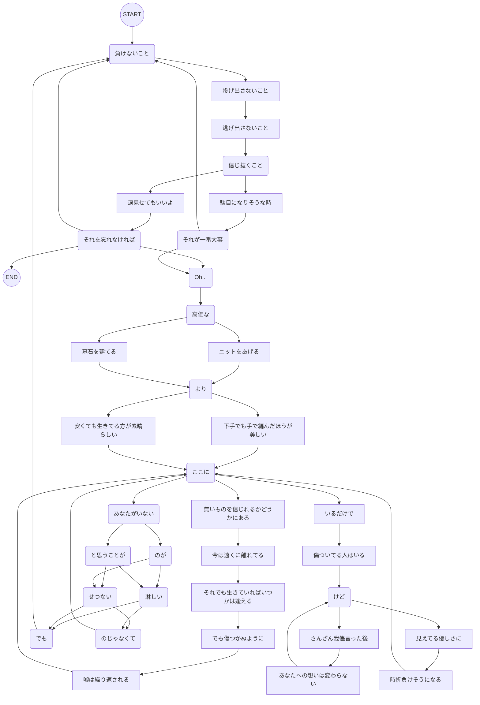

```mermaid
flowchart TD
   START((START)) --> A(負けないこと) --> 投げ出さないこと --> 逃げ出さないこと --> B(信じ抜くこと) --> 涙見せてもいいよ --> C(それを忘れなければ) --> END((END))
   B --> 駄目になりそうな時 --> D(それが一番大事) --> A
   C --> A
   C --> E(Oh...) --> F(高価な) --> ニットをあげる --> G(より) --> 下手でも手で編んだほうが美しい --> H(ここに) --> 無いものを信じれるかどうかにある --> 今は遠くに離れてる --> それでも生きていればいつかは逢える --> でも傷つかぬように --> 嘘は繰り返される --> H
   D --> E
   F --> 墓石を建てる --> G --> 安くても生きてる方が素晴らしい --> H --> I(あなたがいない) --> J(のが) --> K(淋しい) --> L(でも)
   I --> M(と思うことが) --> N(せつない) --> O(のじゃなくて)
   J --> N --> L --> A
   M --> K --> O --> H --> いるだけで --> 傷ついてる人はいる --> P(けど) --> 見えてる優しさに --> 時折負けそうになる --> H
   P --> さんざん我儘言った後 --> あなたへの想いは変わらない --> P
```
